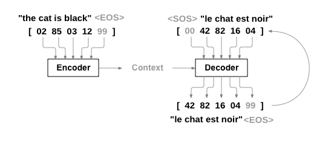
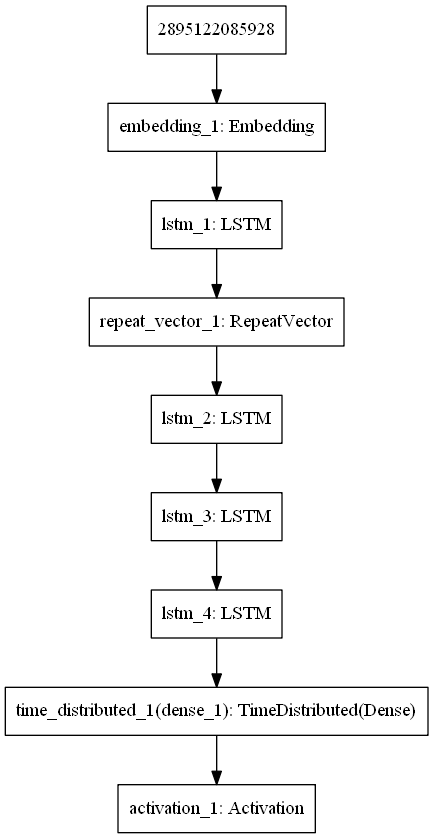

# Machine translation using Sequence to Sequence Learning
In this notebook, we will build a model that takes sentence (sequence of words) in source language and translate it to sentence in target language.

## Overview of repository contents (obvious elements omitted)
```sh
.
├── colab_tools.py      # methods useful for urning on google colab
├── config.py			# exemplary configurations for different experiments
├── dataset 			
│   ├── test 			# English sentences not used in training, to be used in testing
│   ├── vocab_en 		# English sentences for training
│   └── vocab_fr 		# French sentences for training
├── images 				# images for README, model image is also saved here by default
├── machine_translation.ipynb 	# notebook version of script for launching training
├── network.py 			# methods for network, creation, training and testing
├── preporcessing.py 	# methods for preparing data for training or testing
├── run_testing.py 		# script to experiment with training
├── run_training.py		# script to experiment with testing trained network
├── test
│   └── test_training.py # integration test for training (short training)
└── utils.py			# helper methods
```

**Figure 1. Translating sentences using encoder-decoder architecture**
## Running on Google Colab
It is convenient to run experiments on [Google Colab](https://colab.research.google.com) that allows to run training in the cloud using GPU.

## Dataset
The dataset used in this experiment is a parallel corpus - i.e. set of sentences in one language and coresponding sequences in other language.

The dataset lives in `/data/` folder. It is made of the following files:
- `vocab_en`: The list of sentences in source language. One sentence per line.
- `vocab_fr`: The list of sentences that will be used in training process. Each sequence is an equivalent of sequence from `vocab_en` file in the same line.

## Preprocessing
To feed the neural network with the training data we need to transform input text files for source and target language into matrices where words are represented by theirs indices from the dictionary.

### Reading input data
Can be done in two ways:
- read from file on file system
- read from Google Drive (useful for running notebook on Google Colab)

### Splitting text into sentences

### Reversing the order of the input sequences
It was reported in the original ["Sequence to sequence"](https://papers.nips.cc/paper/5346-sequence-to-sequence-learning-with-neural-networks.pdf) paper from google (and in other works) that reversing the input sequence improves accuracy. The intuition might be here that words that are last in the input sequence are closer to words in output sequence (first words) and that helps to build associations between them.

### Create necessary mappings
In the matrix representation of the training data we don't use words as such. Words are replaced by indices.
There are following steps in the mapping creation:
1. Create vocabulary dictionary
2. Create two dictionaries that allows to map words to indices and reverse: map indices back to words.
3. Having tools for the mapping the actual conversion of words to indices in being done both for sentences in source and target language

### fit the matrix 'width' to the length of the longest sentence

### Pad with zeros
For the sentences having less words than longest sentence in the dataset fill the 'cells' for missing words with zeros. This is padding with zeros.

### One hot encoding
Last part of data preparation is "one hot encoding" which transforms vector of indices to matrix of zeros and ones. Each column in the matrix corresponds to one indice. The column consist of zeros except one position corresponding to indice to encode - where is "one" placed.

## Model
Model consist of two parts:
- Encoder
- Decoder

### Encoder
First layer in the model is for embedding - optional but can improve accuracy, followed by hidden layers build from LSTM elements.
Last element in the encoder is repeat vector.

### Decoder 
decoder consist of number of hidden layers build from LSTM elements. Then come dense connections between the layers and activation layer using softmax activation function.



**Figure 2. Architecture of the model with three hidden layers in decoder**
## Training
Training is being done for `1000` of sequences at time. After each epoch weights are stored in the file - that allows to resume training from the last checkpoint.

